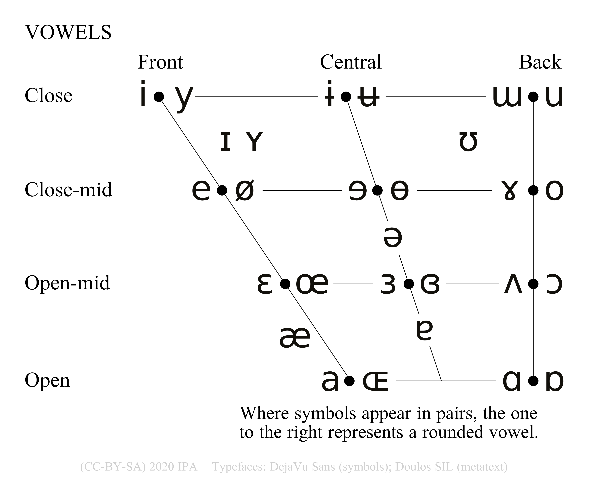
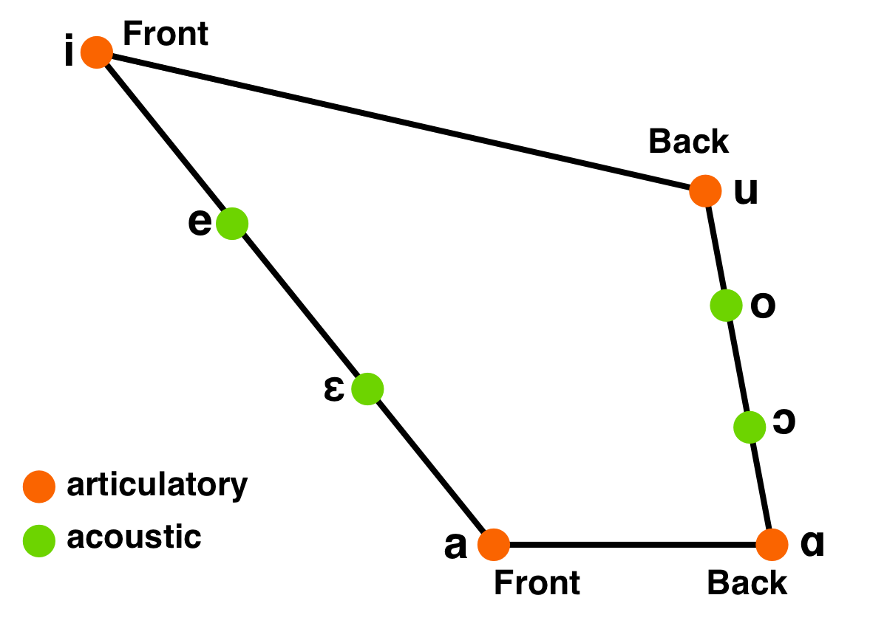
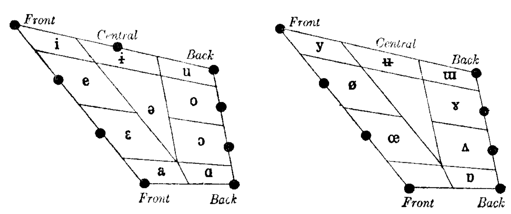
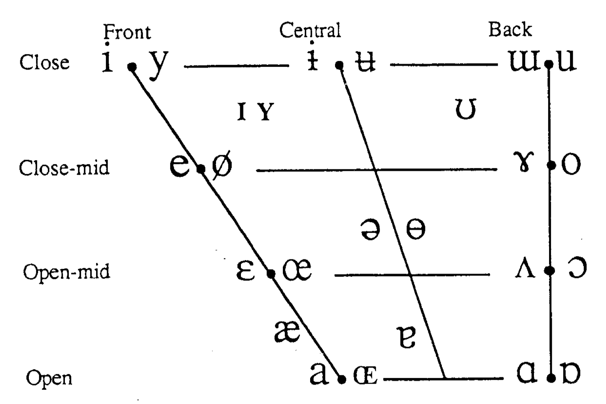
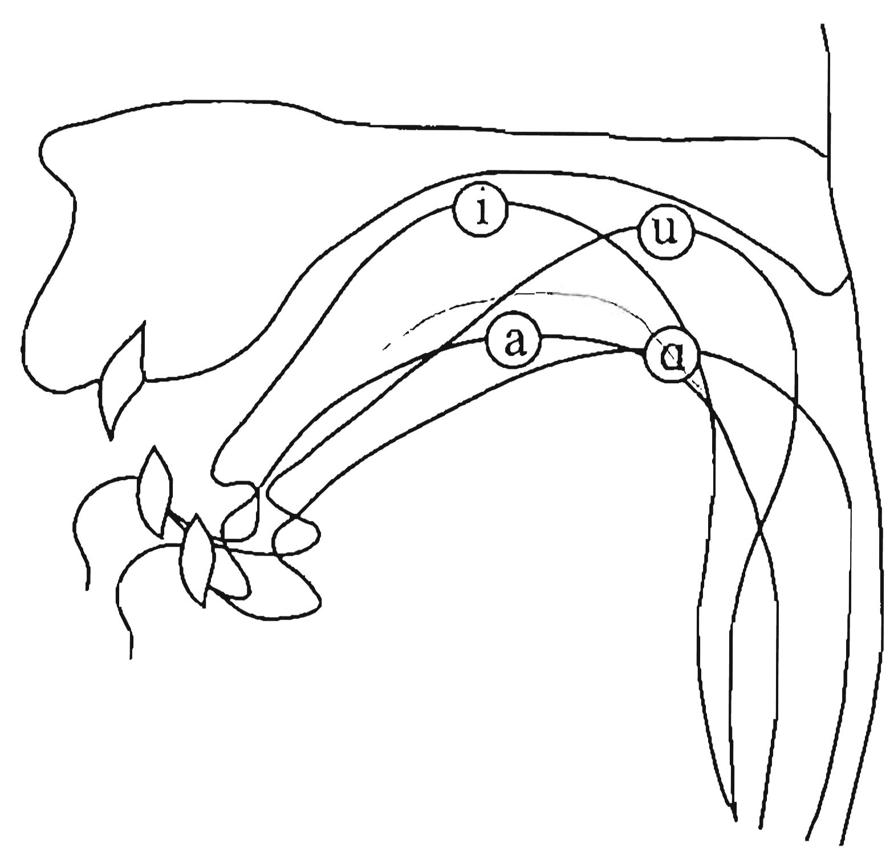

```{r setup, include=FALSE}
options(htmltools.dir.version = FALSE)
knitr::opts_chunk$set(
  fig.width=7, fig.height=5, fig.retina=3,
  out.width = "60%", fig.align = "center",
  cache = FALSE,
  echo = TRUE,
  message = FALSE, 
  warning = FALSE,
  hiline = TRUE
)
knitr::opts_knit$set(root.dir = here::here())

library(xaringanExtra)
use_xaringan_extra(c("panelset", "tachyons", "freezeframe"))

options(ggplot2.discrete.fill = RColorBrewer::brewer.pal(8, "Dark2"))
options(ggplot2.discrete.colour = RColorBrewer::brewer.pal(8, "Dark2"))
```

```{r xaringan-themer, include=FALSE, warning=FALSE}
library(xaringanthemer)
style_mono_light(outfile = "xaringan-themer.css")
```

layout: true

## The vowel quadrilateral

---

.center[

]

---

.center[

]

IPA 1949

---

.center[

]

IPA 1949

---

.center[

]

IPA 1949

---

.center[

]

IPA 1949

---

.center[

]

IPA 1949

---

*Principles of the IPA* (IPA 1949):

- 20: [I]t is recommended that the nearest appropriate roman letter be substituted for it.

- 21: As sounds of the **ɒ** type have considerable acoustic similarity to those in the **ɔ** and **ɑ** areas, it is generally advisable to represent them by one of these more familiar symbols.

---

*Report on the 1989 Kiel Conventio* (IPA 1989)

> The relationship between vowels is described by plotting them on a quadrilateral, which represent an abstract, notional 'vowel space'. This vowel space has a correlation, though not an exact correspondence, with each of two aspects of the physical speech event of vowels: the position of the tongue; and the acoustic (and, relatedly, auditory) reflex of a vowel's production expressed as a plotting of its resonant frequences.

--

.center[

]

---

.center[

]

---

*The Handbook of the IPA* (IPA 1999):

> The use of auditory spacing in the definition of these vowels means vowel description is not based purely on articulation, and is one reason why the vowel quadrilateral must be regarded as an abstraction and not a direct mapping of tongue position.

--

.center[

]
