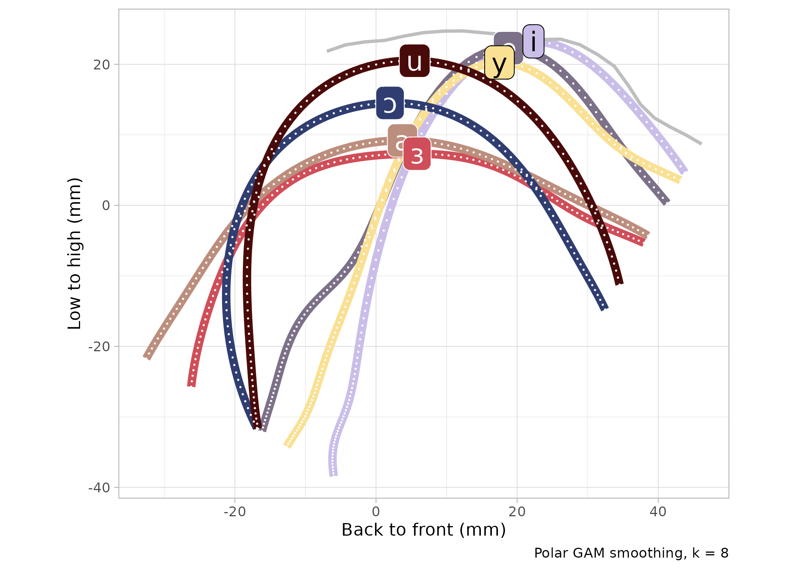
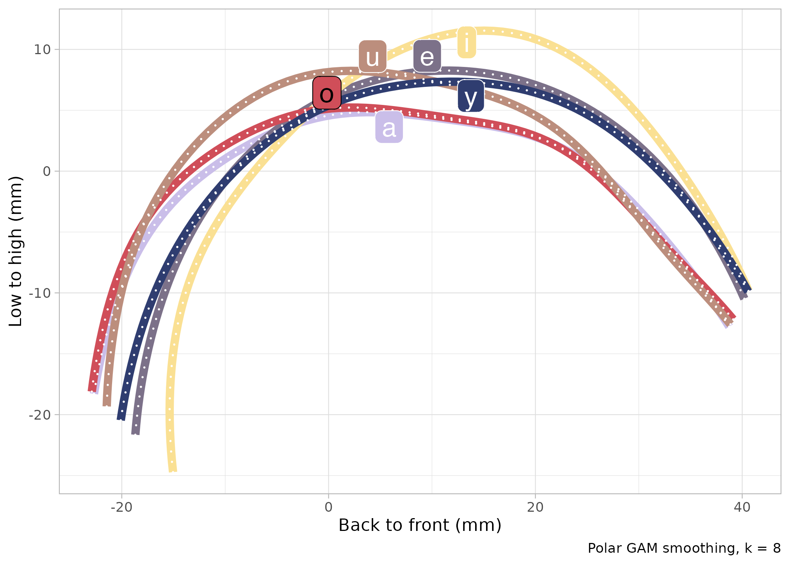
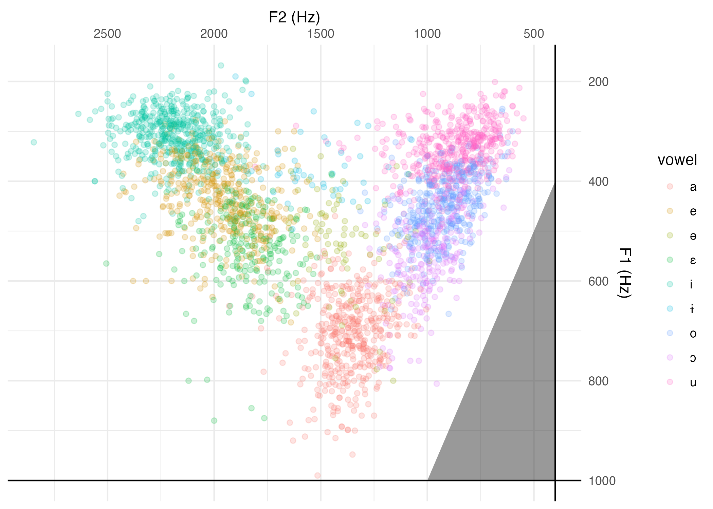
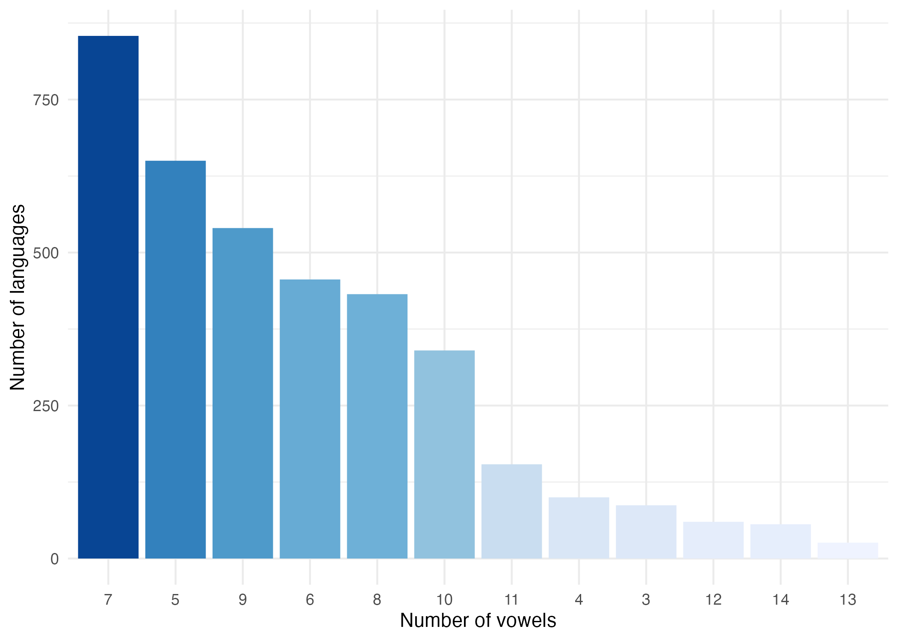
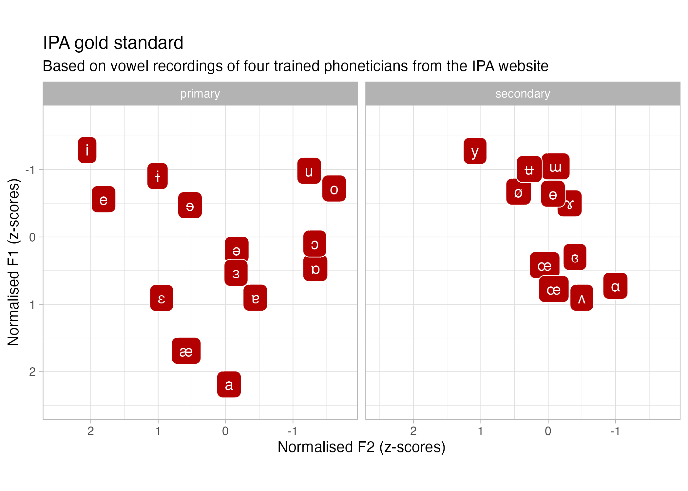
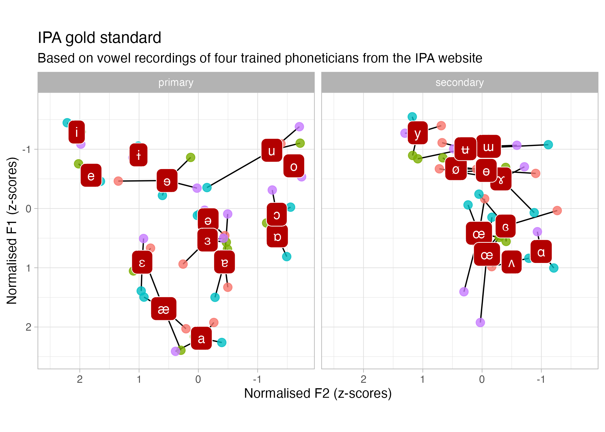
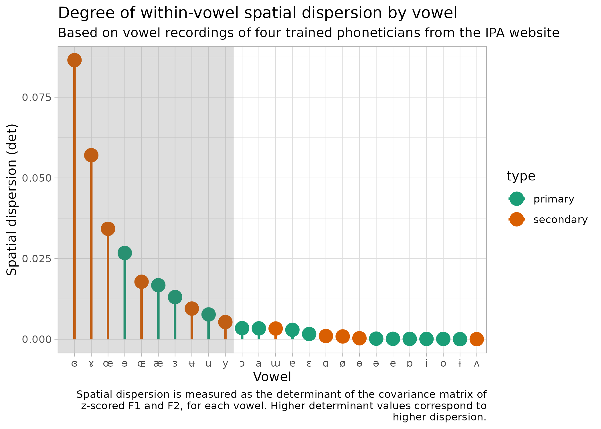
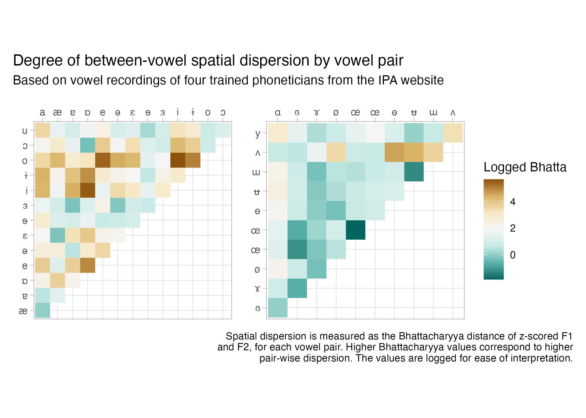
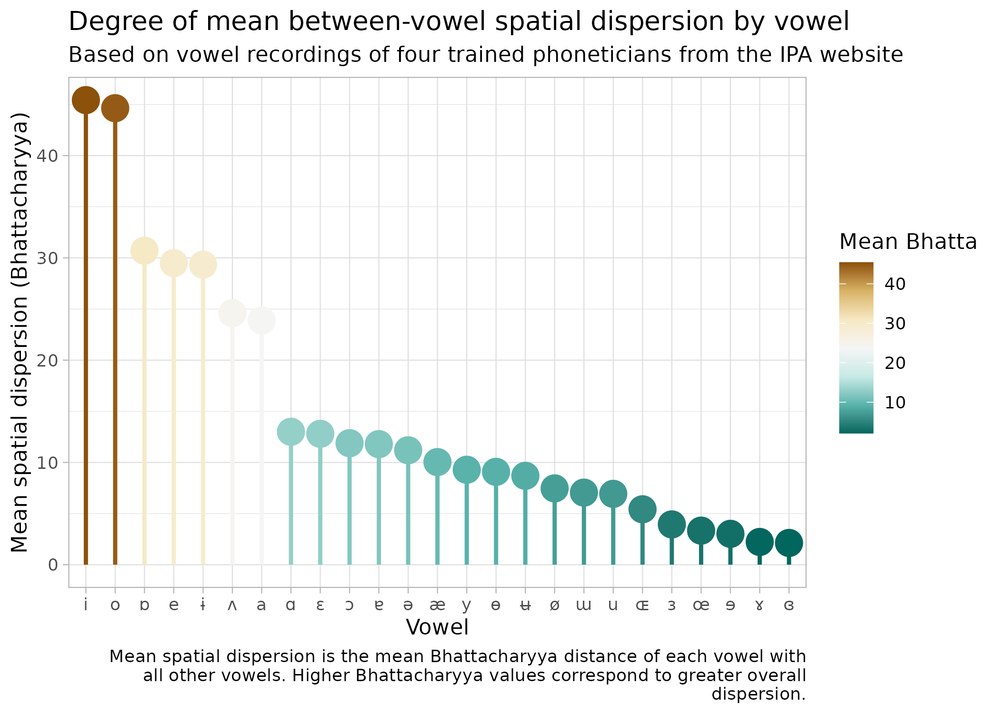
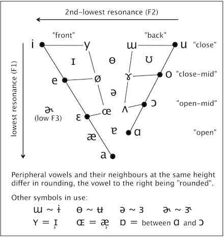

```{r setup, include=FALSE}
options(htmltools.dir.version = FALSE)
knitr::opts_chunk$set(
  fig.width=7, fig.height=5, fig.retina=3,
  out.width = "60%", fig.align = "center",
  cache = FALSE,
  echo = TRUE,
  message = FALSE, 
  warning = FALSE,
  hiline = TRUE
)
knitr::opts_knit$set(root.dir = here::here())

library(xaringanExtra)
use_xaringan_extra(c("panelset", "tachyons", "freezeframe"))

options(ggplot2.discrete.fill = RColorBrewer::brewer.pal(8, "Dark2"))
options(ggplot2.discrete.colour = RColorBrewer::brewer.pal(8, "Dark2"))
```

```{r xaringan-themer, include=FALSE, warning=FALSE}
library(xaringanthemer)
style_mono_light(outfile = "xaringan-themer.css")
```

class: center middle inverse

## DISCLAIMER

---

layout: true

## The vowel quadrilateral

---

.center[

]

---

.center[

]

IPA 1949

---

.center[

]

IPA 1949

---

.center[

]

IPA 1949

---

.center[

]

IPA 1949

---

.center[

]

IPA 1949

---

*Principles of the IPA* (IPA 1949):

- 20: [I]t is recommended that the nearest appropriate roman letter be substituted for it.

- 21: As sounds of the **ɒ** type have considerable acoustic similarity to those in the **ɔ** and **ɑ** areas, it is generally advisable to represent them by one of these more familiar symbols.

---

*Report on the 1989 Kiel Conventio* (IPA 1989)

> The relationship between vowels is described by plotting them on a quadrilateral, which represent an abstract, notional 'vowel space'. This vowel space has a correlation, though not an exact correspondence, with each of two aspects of the physical speech event of vowels: the position of the tongue; and the acoustic (and, relatedly, auditory) reflex of a vowel's production expressed as a plotting of its resonant frequences.

--

.center[

]

---

.center[

]

---

*The Handbook of the IPA* (IPA 1999):

> The use of auditory spacing in the definition of these vowels means vowel description is not based purely on articulation, and is one reason why the vowel quadrilateral must be regarded as an abstraction and not a direct mapping of tongue position.

--

.center[

]

---

layout: false
layout: true

## Articulatory vowel space

---

.center[

]

Northern Tosk Albanian (Coretta et al 2022)

---

.center[

]

Polish (Strycharczuk et al 2021)

---

Ladefoged's informal CV:

> Daniel Jones himself published photographs of only four of his own cardinal vowels, although, as he told me in 1955, he had photographs of all 8 vowels. When I asked him why he had not published the other four photographs, he smiled and said **"People would have found them too confusing."**

(<https://linguistics.ucla.edu/people/ladefoge/PLcareer.pdf>)

--

.center[
<iframe src="https://giphy.com/embed/jivGITd768psP80B2i" width="480" height="350" frameBorder="0" class="giphy-embed" allowFullScreen></iframe>
]

---

layout: false
layout: true

## Acoustic vowel space

---

.center[

]

Data from Becker-Kristal (2010).

---

.center[

]

Data from Becker-Kristal (2010).

---

layout: false
layout: true

## The gold standard

---

.center[

]

---

.center[

]

---

.center[

]

---

.center[

]

---

.center[

]


---

layout: false
layout: true

## Lindsey's alternative

---

.center[

]

From <https://www.englishspeechservices.com/blog/the-vowel-space/>.

---

layout: false
layout: true

## From the history of the IPA

---

- Göran Hammarström in 1973: critique of recordings and judgements.

- Michael Ashby in 1989: critique of Jones's quadrilateral.

---

layout: false
layout: true

## Conclusions

---

- Reasons behind the IPA vowel quadrilateral shows that the initial articulatory + auditory criteria were abstracted over time.

- Articulatory space is much more complex than what the chart suggests.

- Acoustic space is not a trapezoid but a triangle.

- History of the IPA there were critics of the trapezoid.

- Lindsey's alternative vowel triangle is the best improvement we got so far.
