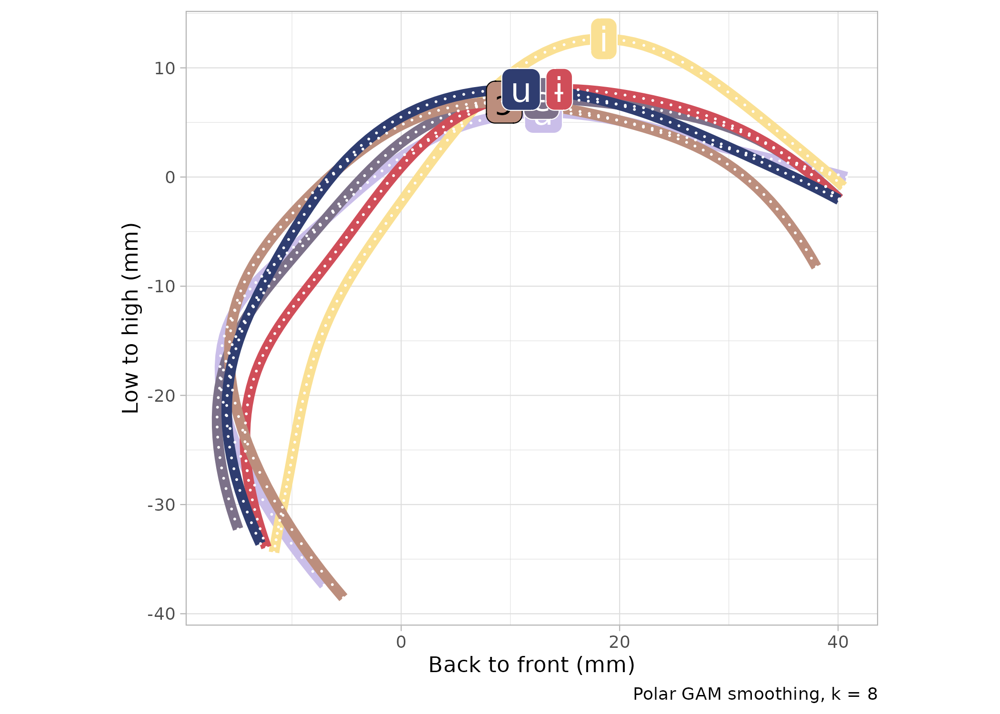
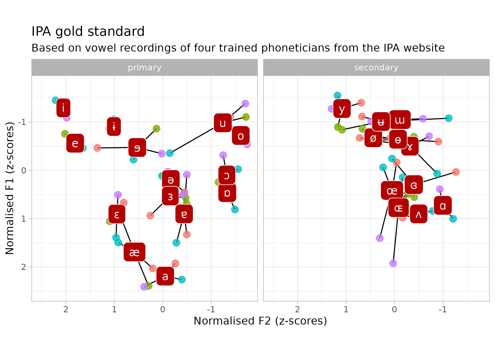
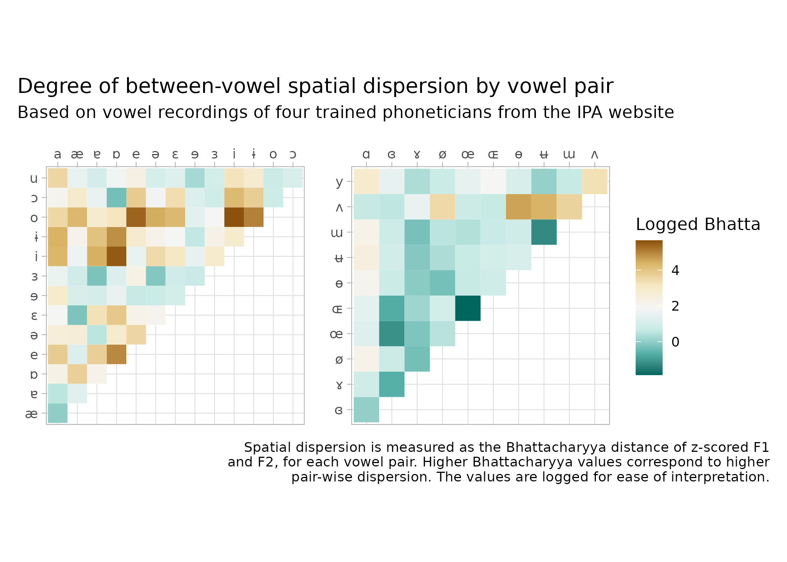

```{r setup, include=FALSE}
options(htmltools.dir.version = FALSE)
knitr::opts_chunk$set(
  fig.width=7, fig.height=5, fig.retina=3,
  out.width = "60%", fig.align = "center",
  cache = FALSE,
  echo = TRUE,
  message = FALSE, 
  warning = FALSE,
  hiline = TRUE
)
knitr::opts_knit$set(root.dir = here::here())

library(xaringanExtra)
use_xaringan_extra(c("panelset", "tachyons", "freezeframe"))

options(ggplot2.discrete.fill = RColorBrewer::brewer.pal(8, "Dark2"))
options(ggplot2.discrete.colour = RColorBrewer::brewer.pal(8, "Dark2"))
```

```{r xaringan-themer, include=FALSE, warning=FALSE}
library(xaringanthemer)
style_mono_light(
  outfile = "xaringan-themer.css",
  link_color = "#944339"
)
```


## Introduction

- IPA vowel chart as a **descriptive tool** (describe the sound systems of the world's languages).

- Relevant to **descriptive and explanatory theory/frameworks**.

- This work has in mind descriptive phoneticians especially.

- I **collated research** and ideas of others (especially Geoff Lidsey), plus a few bits of my own.

- This is **work in...cepient**. Constructive feedback welcome!

---

## Outline

- History of the IPA vowel chart.

- Articulatory vowel space.

- Acoustic vowel space.

- Alternative chart (Lindsey's proposal).

- Conclusion.

---

layout: true

## The IPA vowel quadrilateral: A history

---

.center[

]


Official IPA vowel quadrilateral (IPA website)

---

.center[

]

IPA 1949: The Principles of the IPA

---

### *Principles of the IPA* (IPA 1949)

**Phonemic nature** of the chart:

- 3(c): In applying the alphabet to any particular language, regard should be had to two fundamental phonetic principles: the **theory of "phonemes"** and the **theory of "cardinal sounds"**.

- 20: When a vowel is situated in an area designated by a non-roman letter, it is recommended that the **nearest appropriate roman letter** be substituted for it.

- 21: As sounds of the **ɒ** type have considerable acoustic similarity to those in the **ɔ** and **ɑ** areas, it is generally advisable to represent them by one of these **more familiar symbols**.

---

.center[

]

IPA 1949: The Principles of the IPA

---

### *Report on the 1989 Kiel Convention* (IPA 1989)

> "Deletion of number of references to the phoneme" [p 67]

> "The use of symbols in representing the sounds of a particular language is usually guided by the principles of **phonological contrast**." [p 68]

> "The relationship between vowels is described by plotting them on a quadrilateral, which represent an abstract, notional 'vowel space'. This vowel space has a correlation, though not an exact correspondence, with each of two aspects of the physical speech event of vowels: the **position of the tongue**; and the acoustic (and, relatedly, auditory) reflex of a vowel's production expressed as a **plotting of its resonant frequencies**." [p 72]

---

.center[

]

IPA 1949: Report on the 1989 Kiel Convention

---

### *The Handbook of the IPA* (IPA 1999)

.center[

]

---

### *The Handbook of the IPA* (IPA 1999)

> The use of auditory spacing in the definition of these vowels means [that] vowel description is not based purely on articulation, and is one reason why the vowel quadrilateral must be regarded as an abstraction and **not a direct mapping of tongue position**.

--

.center[

]

---

layout: false
layout: true

## Articulatory vowel space

---

- From **Ladefoged**'s [informal CV](https://linguistics.ucla.edu/people/ladefoge/PLcareer.pdf>) (cited in Lindsey 2017):

> "Jones never defined what he meant by saying that the cardinal vowels were acoustically equidistant. He thought that the tongue made equal movements between each of them, even after the publication of x-ray views of the 8 primary cardinal vowels produced by his colleague Stephen Jones showed that this was not the case (Jones, 1929).

> Daniel Jones himself published photographs of only four of his own cardinal vowels, although, as he told me in 1955, he had photographs of all 8 vowels. When I asked him why he had not published the other four photographs, he smiled and said **'People would have found them too confusing.'**"

--

- **Ashby 1989**: critique of Jones's chart.

---

- Not sure of the existence of published work that directly address this empirical question.

- Articulatory space should probably not be based on a single point from the midsagittal contour of the tongue (tongue is a 3D object and what about other articulators)?

- Jim Scobbie is working on something related this.

- For now, some preliminary data from Northern Tosk Albanian and Polish... (CAVEAT: these are language-specific vowels, rather than cardinal vowels per se).

---

.center[

]

Northern Tosk Albanian (Coretta et al 2022)

---

.center[

]

Polish (Strycharczuk et al 2021).

---

layout: false
layout: true

## Acoustic vowel space

---

### *Report on the 1989 Kiel Convention* (IPA 1989)

> "The relationship between vowels is described by plotting them on a quadrilateral, which represent an abstract, notional 'vowel space'. This vowel space has a correlation, though not an exact correspondence, with each of two aspects of the physical speech event of vowels: the position of the tongue; and the acoustic (and, relatedly, auditory) reflex of a vowel's production expressed as a **plotting of its resonant frequencies**." [p 72]

--

<br>

- Ideally, if we plot F1/F2 values, **shape** of the vowel space and **position** of the vowels in it should correlate with shape of and positions in the IPA vowel quadrilateral.

- Gold standard recordings of the IPA vowels.

- Data of F1/F2 **centroids of the vowels of 231 languages** (Becker-Kristal 2010). Work on the dispersion hypothesis of vowel inventories.

---

.center[

]

---

.center[

]

---

.center[

]

---

.center[

]

Data from Becker-Kristal (2010).


---

layout: false
layout: true

## Lindsey's alternative

---

.center[

]

From <https://www.englishspeechservices.com/blog/the-vowel-space/> and Lindsey 2017.

---

layout: false
layout: true

## Conclusions

---

- IPA vowel chart as a descriptive tool:

  - Position of the tongue and plotting of formants (albeit abstracted).

- However:

  - Articulation is much more complex (and studies are needed).
  
  - Acoustic F1/F2 space shape and position of vowels in it don't match the chart.

- Lindsey's alternative vowel triangle is the best improvement we got so far.

---

class: center middle inverse

## APPENDIX

---

layout: false
layout: true

## The gold standard

---

.center[

]

---

.center[

]

---

.center[

]

---

.center[

]

---

.center[

]

---

- Not sure of the existence of work that directly address this empirical question.

- Hammarström 1973: critique of recordings and judgements of phoneticians.
